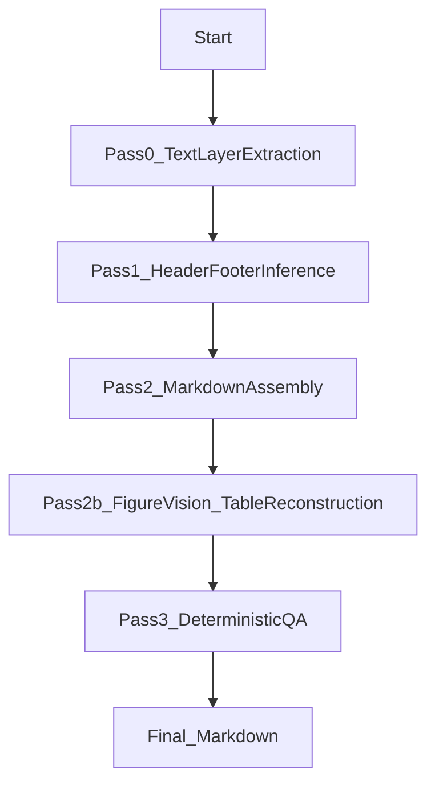

# PDF to Markdown Converter (Local) 仕様書兼設計書

本書は現行実装に基づく仕様書兼設計書です。参照元: `README.md`, `main.py`, `pdf_to_md_textfirst.py`, `lmstudio_client.py`

## 1. 概要

ローカル環境で PDF を Markdown に変換するテキスト優先型コンバータ。本文は PDF のテキストレイヤから抽出し、図の説明のみを Vision モデルで補う。表はテキストレイヤの単語バウンディングボックスから再構成する。

## 2. 目的と設計方針

- 本文忠実度の最大化: OCR/LLM 生成ではなく PDF のテキストレイヤを主データとする
- 図は必ず Vision による説明を付与する
- 表はテキストレイヤ由来の幾何情報で再構成する
- QA は決定的なルールで検査し、しきい値未達は失敗扱い

## 3. 動作環境・依存

- Python 3.10+
- LM Studio (ローカル) 起動済み
  - 既定モデル: `qwen/qwen2.5-vl-7b`
- 主要ライブラリ: PyMuPDF (fitz), Pillow, requests
- Poppler (必要な場合のみ、pdf2image 用)

## 4. 入出力仕様

### 4.1 入力

- 単一ファイル: `python main.py --single "<path/to.pdf>"`
- バッチ: `python main.py` (既定: `input/` 配下の PDF を列挙)

### 4.2 出力

`output/<paper>_<timestamp>/` にランディレクトリを作成し、以下を出力する。

```
text_layer/          # Pass0: line-level JSON per page
words_layer/         # Pass0: word-level JSON per page
pass1_layout_debug.json
pass2_body_with_placeholders.md
pass2_full.md
pass3_qa.json
<paper>.md           # 最終 Markdown
status.json          # 実行状態 (RunRecorder)
checkpoint.jsonl     # チェックポイント
gpu_telemetry.csv    # nvidia-smi が利用可能な場合のみ
```

## 5. アーキテクチャ概要

```
Pass0: Text Layer Extraction (PyMuPDF)
  ↓
Pass1: Header/Footer Inference (repetition-based)
  ↓
Pass2: Markdown Assembly (headings via font size + bold)
  ↓
Pass2b: Figure Descriptions (Vision) + Table Reconstruction (word bbox)
  ↓
Pass3: Deterministic QA (coverage, ellipsis, code fence, etc.)
  ↓
Final Markdown
```



## 6. モジュール設計

### 6.1 `main.py`

- CLI 引数の解析 (`--input`, `--output`, `--single`)
- 入出力ディレクトリの作成
- LM Studio 接続確認 (`LMStudioClient.check_connection()`)
- `PDFtoMarkdownTextFirst` を用いて変換処理を起動
- バッチモードでは出力済みの PDF をスキップ

### 6.2 `pdf_to_md_textfirst.py`

主要コンバータ実装。以下のコンポーネントで構成。

- `ConverterConfig`: 主要パラメータの既定値
- `RunRecorder`: `status.json`, `checkpoint.jsonl`, `gpu_telemetry.csv` の生成
- Pass0: テキストレイヤ抽出と保存
- Pass1: ヘッダ/フッタ推定
- Pass2: Markdown 組み立て (見出し判定、段落整形、参照/脚注処理)
- Pass2b: 図説明の生成、表の再構成
- Pass3: 決定的 QA

### 6.3 `lmstudio_client.py`

- LM Studio API (`/v1/chat/completions`) への HTTP 呼び出し
- 画像入力を含む Vision リクエストの組み立て
- 接続確認 (`/v1/models`)

## 7. 詳細設計

### 7.1 Pass0: テキストレイヤ抽出

- PyMuPDF でページごとに `get_text("dict")` と `get_text("words")` を使用
- `TextLine` と `Word` を生成し、行単位と単語単位の JSON を保存
- フォントサイズと太字判定を保持

### 7.2 Pass1: ヘッダ/フッタ推定

- テキストの正規化 (数値の `#` 化、記号除去など)
- ページ間の反復出現と Y 位置の安定性でヘッダ/フッタ候補を推定
- 固定比率ではなく可変バンドで判定

### 7.3 Pass2: Markdown 組み立て

- ページ内のカラム数を推定し、読み順を決定
- 見出し判定はフォントサイズ、太字、テキストパターンを併用
- 図表キャプションをプレースホルダとして保持
- 参照/脚注/著者情報などをヒューリスティクスで分離
- 段落結合、インライン見出し分割、不要な空白の正規化を実施

### 7.4 Pass2b: 図説明と表再構成

#### 図説明

- キャプション周辺をクロップして Vision モデルへ送信
- 出力は `- (Generated) ` で始まる箇条書きのみ許容
- 失敗時は `?` のプレースホルダで最小限の出力を保証

#### 表再構成

- キャプション位置から表領域を推定
- 単語のバウンディングボックスを行/列にクラスタリング
- Markdown 表形式に変換 (最大 200 行まで)

### 7.5 Pass3: 決定的 QA

- `code_fence_leak` (``` の混入)
- 図の近傍にテーブルが誤出力されていないか
- `#` タイトルの重複
- 図説明の最小量・最小文字数・省略記号の不在
- カバレッジ率 (本文トークンの一致率) がしきい値未満の場合は失敗

## 8. 設定項目

`ConverterConfig` で調整可能。

| パラメータ | 既定値 | 説明 |
| --- | --- | --- |
| `vision_model` | `qwen/qwen2.5-vl-7b` | 図説明用 Vision モデル |
| `text_model` | `None` | 監査用テキストモデル (未使用) |
| `render_dpi` | `200` | 図のレンダリング DPI |
| `jpeg_quality` | `85` | 画像 JPEG 品質 |
| `max_crop_width_px` | `1400` | 図クロップの最大幅 |
| `band_scan_margin_norm` | `0.15` | ヘッダ/フッタ候補探索範囲 |
| `repeat_ratio_threshold` | `0.50` | 反復判定のページ比率 |
| `hf_position_span_norm` | `0.08` | 位置安定性の許容幅 |
| `max_header_line_len` | `60` | ヘッダ候補の最大長 |
| `coverage_threshold` | `0.95` | カバレッジのしきい値 |
| `min_figure_bullets` | `3` | 図説明の最小箇条書き数 |
| `min_figure_chars` | `120` | 図説明の最小文字数 |
| `max_retries_per_figure` | `1` | 図説明のリトライ回数 |

## 9. エラーハンドリング

- LM Studio へ接続できない場合は起動前に終了
- QA で問題が発生した場合は例外を送出して失敗扱い
- 図説明失敗時は `warnings.log` に記録し、`?` の箇条書きを挿入

## 10. 制約・注意点

- 本文はテキストレイヤ由来 (OCR ではない)
- 参照・脚注・著者情報の判定はヒューリスティクスであり完全一致ではない
- 表再構成はテキストレイヤの幾何情報のみを使うため、複雑な表では精度が低下する可能性がある

## 11. 運用メモ

- バッチ処理は既に出力済みの PDF をスキップする
- 失敗時は `status.json` と `checkpoint.jsonl` で原因追跡可能
